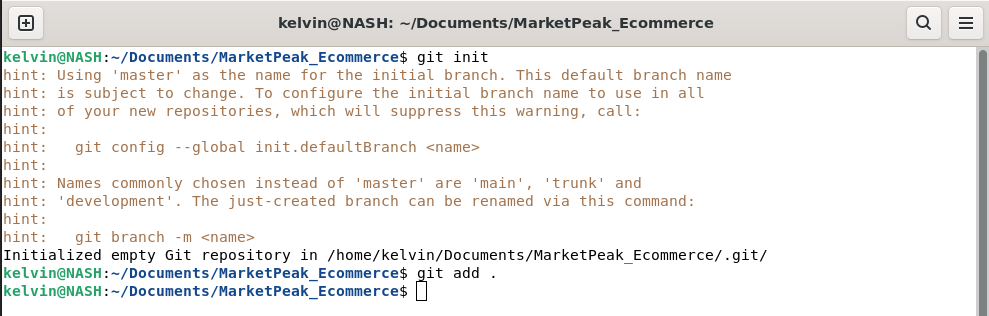
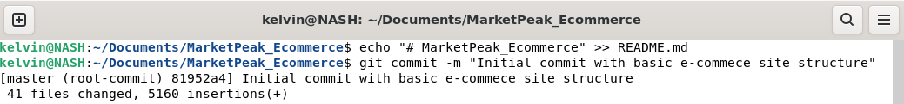
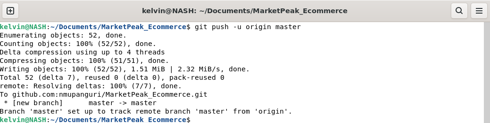
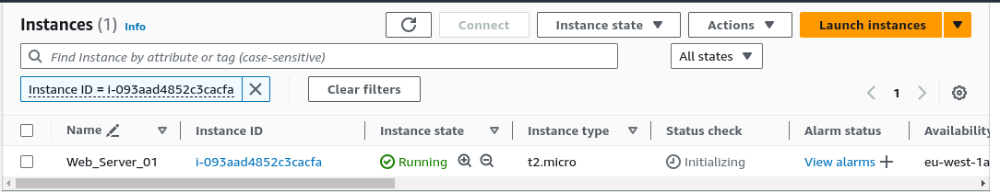
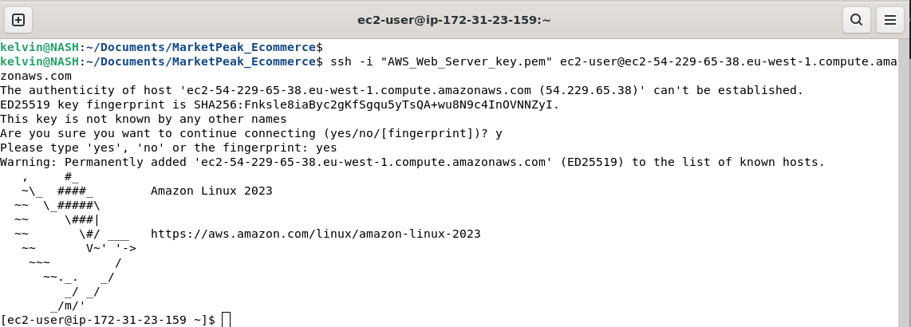
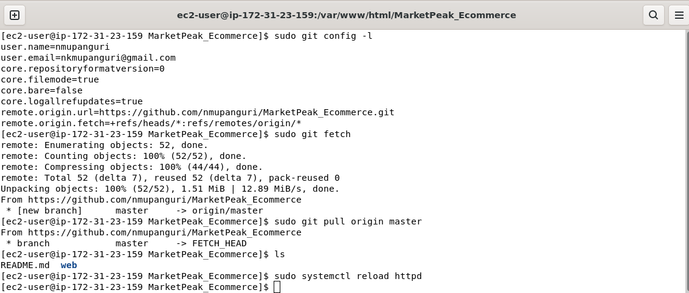
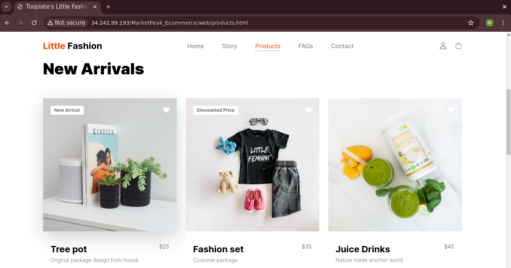
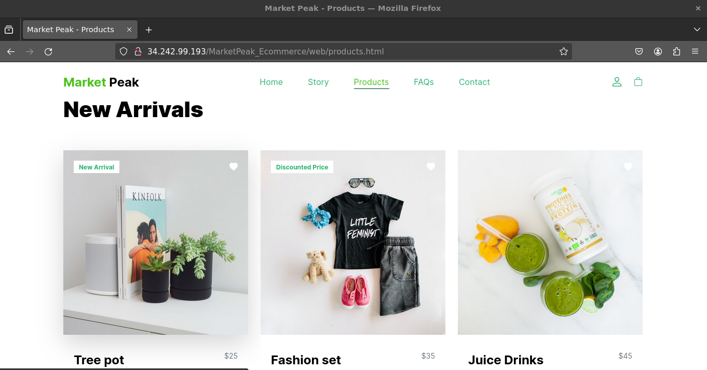

# MarketPeak E-commerce Website

## Overview

In this project, I developed an e-commerce website for a new online marketplace named "MarketPeak". The platform features product listings, a shopping cart, and user authentication. To kickstart development, I utilized a website template from [Tooplate](https://www.tooplate.com/). The purpose of this readme is to narrate the key steps taken to develop the site and host it on a cloud-based web server.

## Key Steps

1. **Downloading the Web Template**: I unzipped the downloaded file and added its contents to a directory named `MarketPeak_Ecommerce` on my local machine. Initializing the folder as a Git repository, it became my local repository.

<figure>
  <figcaption><em><strong>Figure A:</strong> Shows git initialization for the folder MarketPeak_ECommerce.</em></figcaption>
  
</figure>

2. **Committing and Pushing Changes**: After making changes to my local repository, I committed them and pushed the changes to my remote repository.

<figure>
  <figcaption><em><strong>Figure B:</strong> Shows the initial commit for the basic e-commerce site.</em></figcaption>
  
</figure>

<figure>
  <figcaption><em><strong>Figure C:</strong> Shows the results of pushing the changes to remote repository.</em></figcaption>
  
</figure>

3. **Launching an AWS EC2 Instance**: I launched an AWS EC2 instance to serve as the web server hosting the website. After connecting to the server via SSH, I installed Apache web server and Git.

<figure>
  <figcaption><em><strong>Figure D:</strong> Shows the AWS EC2 instance (Web_Server_01) running.</em></figcaption>
  
</figure>

<figure>
  <figcaption><em><strong>Figure E:</strong> Shows successful connection to the server via ssh.</em></figcaption>
  
</figure>

4. **Setting Up Remote Repository on Web Server**: I created a directory named `MarketPeak_Ecommerce` under `/var/www/html/` on the web server. Configuring the folder as a Git repository, I pulled changes from the remote repository.

<figure>
  <figcaption><em><strong>Figure F:</strong> Shows initialisation of the MarketPeak_Ecommerce folder as a repository on the web server.</em></figcaption>
  
</figure>

5. **Testing Initial Setup**: Using the public address of the web server, I accessed the website to confirm that changes made to my local repository could be pushed to the central repository and pulled onto the web server's repository.

<figure>
  <figcaption><em><strong>Figure G:</strong> Shows the Products page on the hosted web server before rebranding.</em></figcaption>
  
</figure>

6. **Branch Management**: To facilitate a smooth workflow for development, testing, and deployment, I created two branches in my local repository. The `documentation` branch was used to update project documentation, while the `development` branch was utilized to customize the template to MarketPeak's brand.

7. **Pushing Changes and Testing Features**: With each iteration of changes made to the branches, I pushed and merged them, testing new features on the web server to ensure they functioned as expected in the live environment.

<figure>
  <figcaption><em><strong>Figure H:</strong> Shows the Products page on the hosted web server after rebranding.</em></figcaption>
  
</figure>

## Workflow and Best Practices

This workflow emphasizes best practices in software development and deployment, including branch management, code review through pull requests, and continuous integration/deployment strategies. Following these steps enabled me to maintain a stable and up-to-date production environment for the MarketPeak e-commerce platform.
